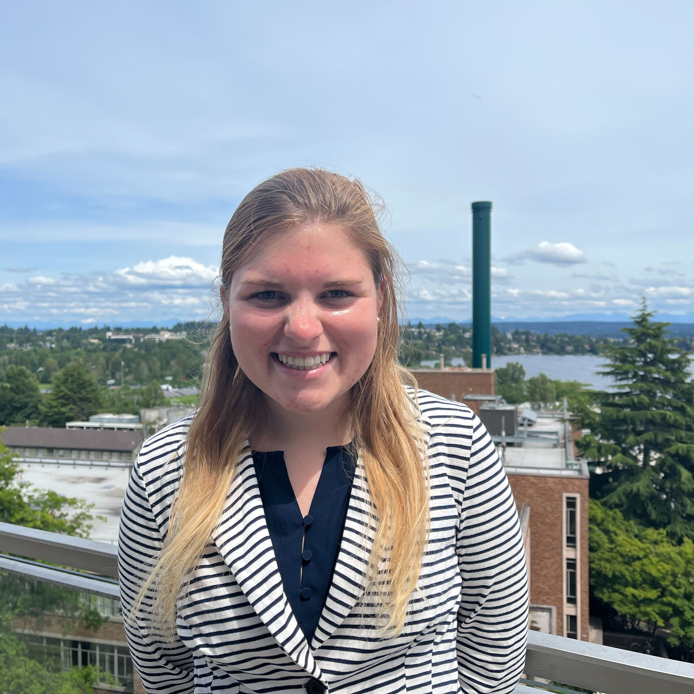

## About Me

I am a second-year NSF GRFP Ph.D. Student in the Department of Mechanical Engineering at the University of Washington, and a student member of the Center for Research and Education on Accessible Technology and Experiences ([CREATE](https://create.uw.edu/)) at the University of Washington. I received my Bachelor's degree in Mechanical Engineering from the University of Notre Dame with a minor in bioengineering. My research is at the intersection of biomechanics, accessibility, and rehabilitation medicine and focuses on the design and translation of mobility and accessible play technologies for young children. My goal in my work is to ''just let kids be kids" exploring the world around them. 

## Research Interests
1. Early Mobility
2. Accessible Play Technologies
3. Environmental Accessibility

---
## Publications

1. **Hoffman, Mia E.**, Katherine M. Steele, Jon E. Froehlich, Kyle N. Winfree, and Heather A. Feldner.  “Off to the Park: A Geospatial Investigation of Ride-on Car Usage.” _Submitted._
2. **Hoffman, Mia E.**, Katherine M. Steele, Kyle N. Winfree, and Heather A. Feldner.  “The Impact of the Built Environment on Early Power Mobility Access.” UrbanAccess’22 Workshop at ASSETS. [link](https://accessiblecities.github.io/UrbanAccess2022/#accepted-papers)
3. Demirci, Nagehan, **Mia E. Hoffman**, and Maria A. Holland. “Systematic cortical thickness patterns in primates suggest a universal physical law of folding.” _Submitted._
4. Darayi, Mohsen, **Mia E. Hoffman**, John Sayut, Shuolun Wang, Nagehan Demirci, Jack Consolini, and Maria A. Holland. 2021. “Computational Models of Cortical Folding: A Review of Common Approaches.” Journal of Biomechanics. 2021. [link](https://doi.org/10.1016/j.jbiomech.2021.110851)

---
## Research Experience
#### Biomechanics & Accessibility | Ability & Innovation Lab, University of Washington | IMPACT Collaboratory, University of Washington
- **Co-advisors:** [Kat M. Steele](https://www.me.washington.edu/facultyfinder/kat-m-steele) and [Heather A. Feldner](https://impactco.rehab.washington.edu/team/heather-feldner/)

#### Medical Imaging & Solid Mechanics | CoMMaND Lab, University of Notre Dame 
- **Advisor:** [Maria A. Holland](https://engineering.nd.edu/faculty/maria-holland/)

#### Auditory Neuroscience & MRI | Auditory Perception and Cognition Lab, University of Minnesota
- **Advisor:** [Andrew Oxenham](https://med.umn.edu/bio/ent-faculty/andrew-oxenham)

#### Auditory Neuroscience & Signal Processing | Carney Lab, University of Rochester
- Advisor: [Laurel H. Carney](https://www.urmc.rochester.edu/people/27094648-laurel-h-carney)

#### Data-Driven Methods | Battelle Center for Mathematical Medicine, Nationwide Children's Hospital
- Advisor: [William C. Ray](https://pediatricsnationwide.org/2022/02/09/featured-researcher-will-ray/)

---
> The future is accessible.
