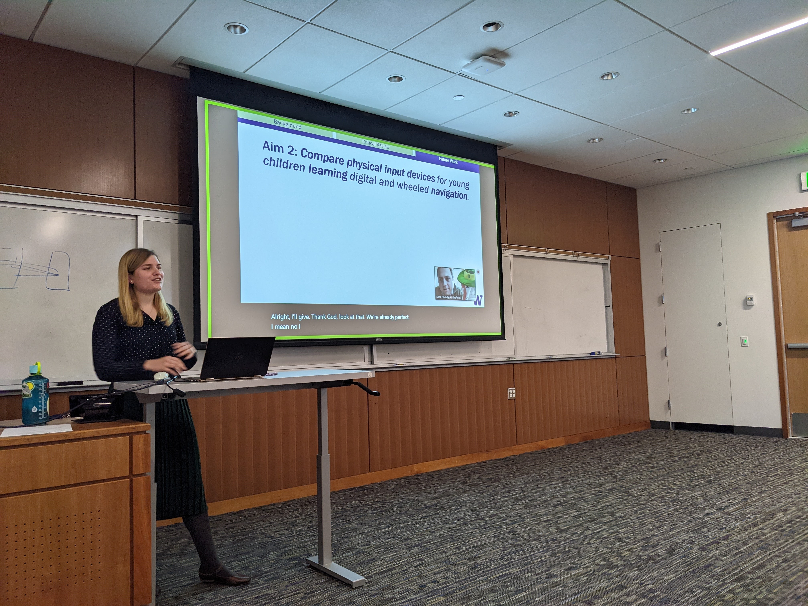
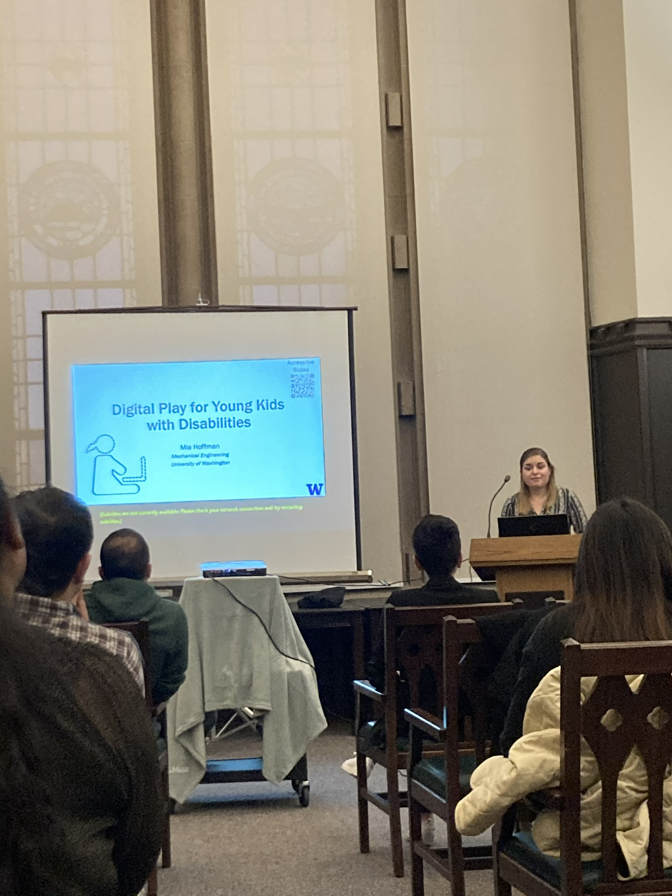
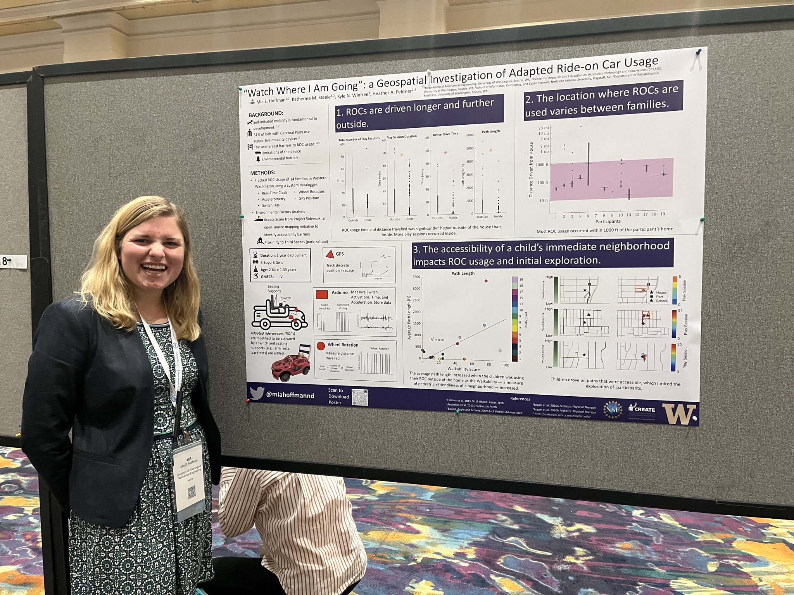

# News

## February 10, 2023: Mia receives a CREATE Student Minigrant

## November 28, 2022: Mia passes her Qualifying Exam

## November 17, 2022: Mia presents at Meta Day at the University of Washington

## October 17, 2022: Mia gives her first podium presentation at ASSETS Urban Access workshop

## September 2022: Mia presents a poster at AACPDM in Las Vegas

## May 2022: Mia presents a poster at NWBS in Pullman, WA

