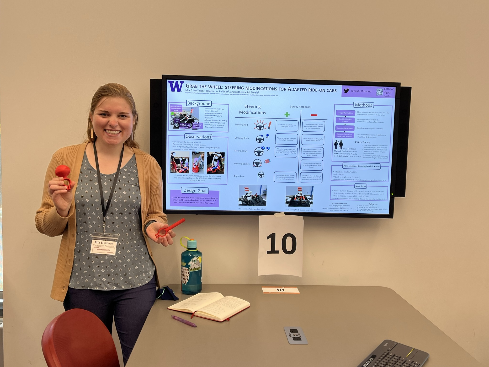

# News

## March 2024: Mia receives NIH INCLUDE TL1 grant.

## February 26, 2024: Article features modified ride-on car accessibility work is published. 

[Click here](https://www.me.washington.edu/news/article/2024-02-26/wheels-in-motion) to read the article.

## December 15, 2023: 'Gears of Progress' podcast episode interviewing Mia.

[Click here](https://open.spotify.com/episode/5kkFQaIhczc4ACfuEEovBu?si=10dc61ca4bdf4b05) to listen to the podcast on Spotify.

## November 7, 2023: Mia passes her General Exam.

## October 22, 2023: Mia mentors at NextProf Pathfinder Workshop at the University of Michigan.

## September 12, 2023: Mia presents a podium presentation at the American Academy of Cerebral Palsy and Developmental Medicine in Chicago.

## July 26, 2023: Mia wins the RESNA Student Paper Competition.

## May 19, 2023: Mia is awarded an honorable mention for her poster at Northwest Biomechanics Symposium.

## April 15, 2023: Mia gives a 15-minute podium presentation at International Seating Symposium

## April 13, 2023: Mia presents a poster at International Seating Symposium

## February 10, 2023: Mia receives a CREATE Student Minigrant

## November 28, 2022: Mia passes her Qualifying Exam

## November 17, 2022: Mia presents at Meta Day at the University of Washington

## October 17, 2022: Mia gives her first podium presentation at ASSETS Urban Access workshop

## September 2022: Mia presents a poster at AACPDM in Las Vegas

## May 2022: Mia presents a poster at NWBS in Pullman, WA

