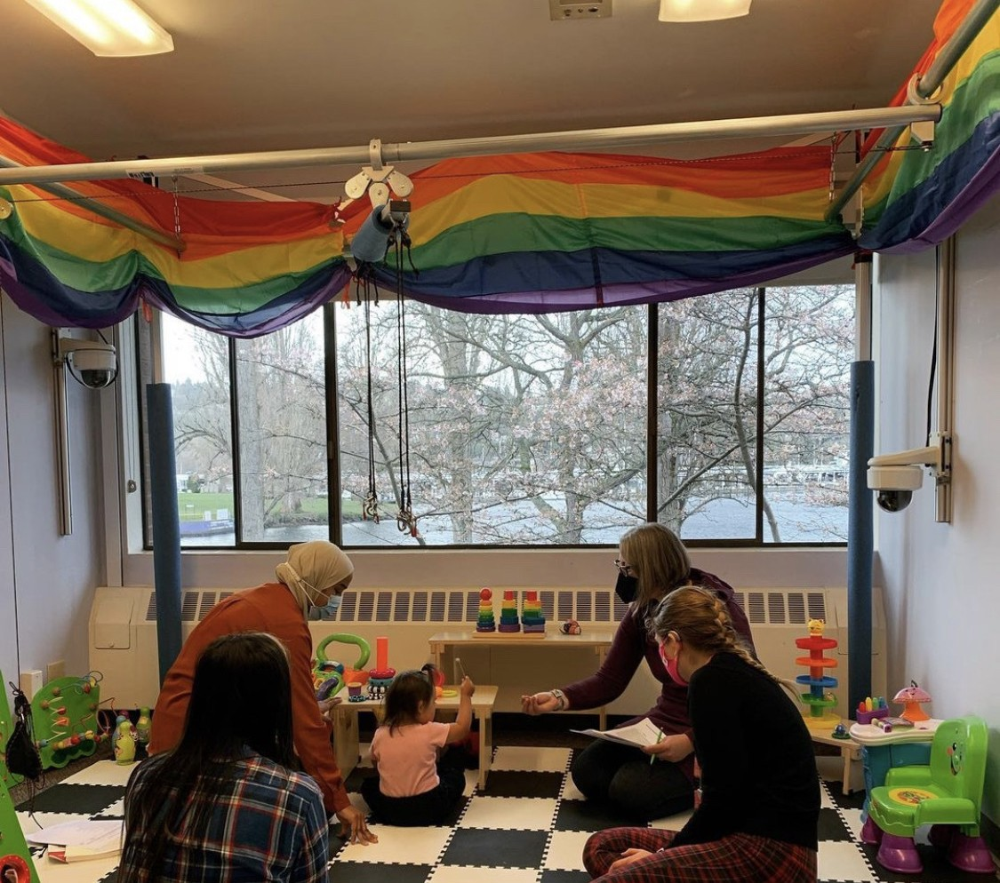
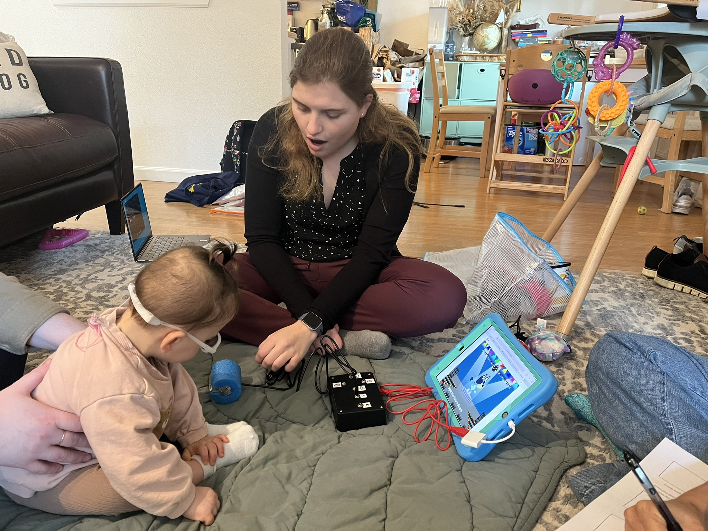
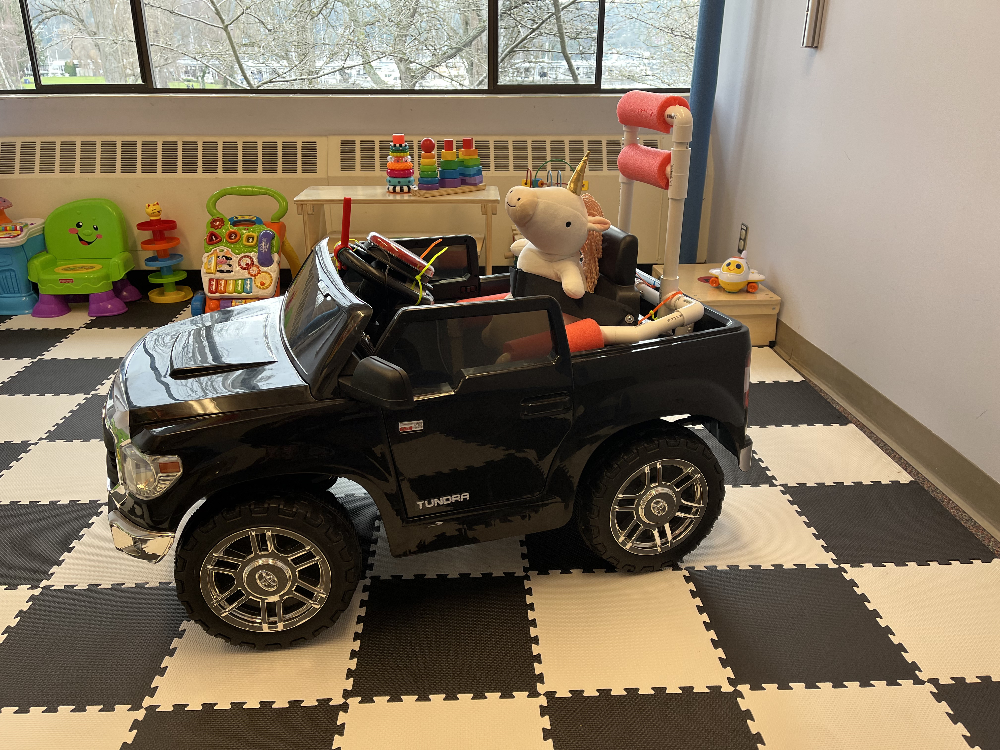

# Projects

## Testing the efficacy of mobility aids for children with Down syndrome

We are currently enrolling local children with Down syndrome (ages 12-36 months) who are not yet indepedently walking to come play with our research team while using a partial bodyweight support system (PUMA, Enliten LLC) or a powered mobility device (Permobil Explorer Mini). While children are playing we will measure their muscle activity using wearable sensors and exploration using body-worn colored tape and a camera system.

  <a href="pdfs/DS Mobility Aids flyer.pdf" target="_blank">
    
  </a>
  <a href="pdfs/UW Mobility Aids Study Community Partner Project Summary.pdf" target="_blank">
    
  </a>

## Development of a switch access playkit for young children alongside families and clincians

A project that initially started as a multidisciplinary clinician-driven capstone team, has evolved into a full research project. We have worked alongside families of children receiving early intervention and their clinicians to create the Switch Kit, a digital playkit that can be accessed using a variety of low-cost, easy-to-fabricate switches. The switch kit consists of three components: 1) digital interactive media created in [Scratch](https://scratch.mit.edu/), 2) an adapted [MakeyMakey](https://makeymakey.com/) input device, and 3) a wide variety of do-it-yourself switches that can be adapted to each specific child. We are currently testing the efficacy of the switch kit through in-home and in-clinic deployments.

<a href="https://miahoffmannd.github.io/switchkit/" target="_blank">
  
</a>

## A clinical trial to test the efficacy of a body weight support system for toddler with Down Syndrome

Working alongside a team of pediatric physical therapists, I participated in a multi-site study testing the efficacy of the [PUMA](enlitenllc.com), a portable passive body-weight support system, for kids with Down syndrome. Fifteen young children with Down syndrome at three different sites participated in 18 play sessions with and without partial bodyweight support provided by the PUMA system. Play sessions involved knocking down block towers, rolling balls, and singing songs. I specifically analyzed children's physical activity levels and time in upright postures during sessions using an ankle-worn accelerometer.

## An on the streets view of environmental accessibility using adapted ride-on cars

Using a custom data logger in an adapted ride-on car, we were able to use GPS data to investigate the impact the accessibility of a child's neighborhood environment has on their usage of their ride-on car. To measure environmental accessibility, we used the AccessScore from [Project Sidewalk](https://sidewalk-sea.cs.washington.edu/), an open-source accessibility mapping initiative, and the Walkability score, a measure of neighborhood pedestrian-friendliness. We found that children played for a longer period of time, actively drove for more of the play session, and drove further when the ROC was driven outside of the home. Most notably, we found that children drove more in pedestrian-friendly neighborhoods and when in proximity to accessible paths. The accessibility of the built environment is paramount when providing any form of mobility device to a child. Providing an accessible place for a child to move, play, and explore is critical in helping a child and family adopt the mobility device into their daily life.

<button name="button" onclick="location.href='https://www.me.washington.edu/news/article/2024-02-26/wheels-in-motion';">Learn more here</button>

## How do children learn to drive an Explorer Mini?

In a collaboration between [CREATE](https://create.uw.edu/) and [I-LABS](https://ilabs.uw.edu/), we worked to understand how young kids learn to use powered mobility and the impact it has on their language development. We used the Permobil Explorer Mini, a recently FDA-approved pediatric wheelchair for kids 1-3 years, in this study. The Explorer Mini used in this study hase sensors incorporated to measure a child's path travelled and their joystick control patterns. Thirteen children participated in up to 12 play-based driving sessions with our team in the lab while we measured their control abilties, muscle activity, and language.

<button name="button" onclick="location.href='https://create.uw.edu/initiatives/moonshot-access-mobility-and-the-brain/';">Learn more here</button>

## Steering modifications to support early mobility

For young children using power mobility, a joystick or steering wheel may hard for them to grasp due to their physical abilities or sensory challenges. As such, we have developed our own modifications for both the steering wheel of an adapted ride-on car and the joystick of an Explorer Mini. This collection of steering modifications for both the adapted ride-on car and the Explorer Mini can be 3D-printed and easily attached to the device.  
