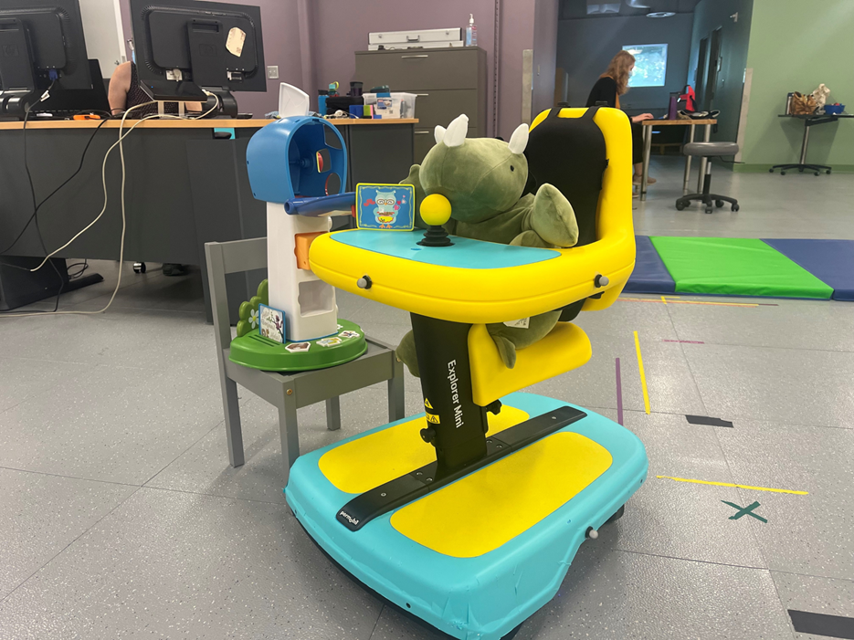
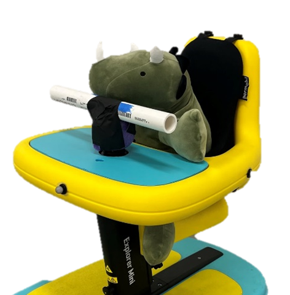
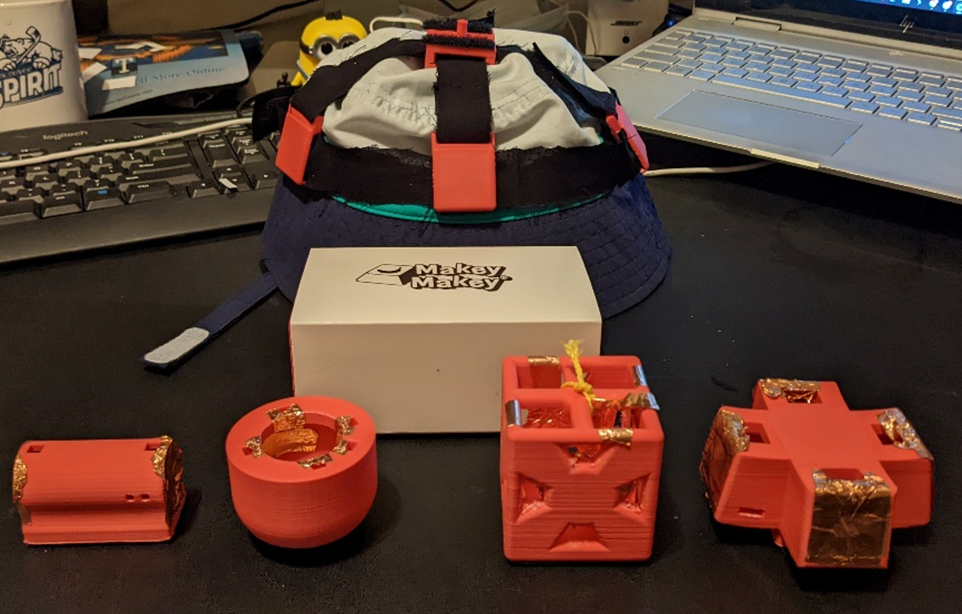
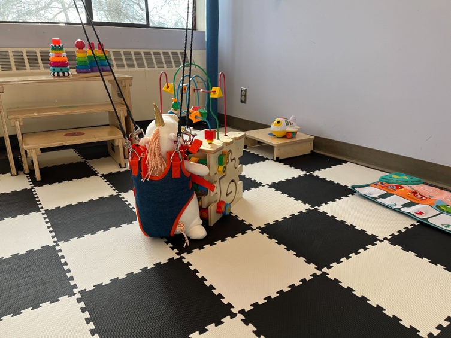

# Projects

## How do children learn to drive an Explorer Mini?

In a collaboration between [CREATE](https://create.uw.edu/) and [I-LABS](https://ilabs.uw.edu/), we are currently working to understand how young kids learn to use powered mobility and the impact it has on their language development. We are using the Explorer Mini, a recently FDA-approved pediatric wheelchair for kids 1-3 years, in this study. We have tricked out the Explorer Mini with sensors to measure a child's path travelled and their joystick control patterns. 

## An on the streets view of environmental accessibility using adapted ride-on cars

Using a custom data logger in an adapted ride-on car, we were able to use GPS data to investigate the impact the accessibility of a child's neighborhood environment has on their usage of their ride-on car. To measure environmental accessibility, we used the \textit{AccessScore} from [Project Sidewalk](https://sidewalk-sea.cs.washington.edu/), an open-source accessibility mapping initiative, and the Walkability score, a measure of neighborhood pedestrian-friendliness. We found that children played for a longer period of time, actively drove for more of the play session, and drove further when the ROC was driven outside of the home. Most notably, we found that children drove more in pedestrian-friendly neighborhoods and when in proximity to accessible paths. The accessibility of the built environment is paramount when providing any form of mobility device to a child. Providing an accessible place for a child to move, play, and explore is critical in helping a child and family adopt the mobility device into their daily life.

## Steering modifications to support early mobility

For young children using power mobility, a joystick or steering wheel may hard for them to grasp due to their physical abilities or sensory challenges. As such, we have been hacking our own modifications for both the steering wheel of an adapted ride-on car and the joystick of an Explorer Mini. We are creating a suite of steering modifications for both the adapted ride-on car and the Explorer Mini that can be 3D printed and easily attached to the device. 

## Development of a switch access toolkit for young children

During the winter and spring of 2022, I helped to mentor a BioE/ME capstone this past academic year that was developing a way for a 2 year old with Cerebral Palsy to play with her older sister (5 years old). The team used a Makey Makey to create a human-computer interface using different mechanical switches. I have since incorporated this project into my research to co-design a switch access training toolkit that Early Intervention therapists (e.g.,physical, occupational, speech language pathology) can use with their clients. We are also planning on using this toolkit to study upper extremity movements in young kids with CP, and the impact of alternative controls. 

## Testing the efficacy of a body weight support system for toddler with Down Syndrome

I have also gotten some "clinical" experience through shadowing local EI therapists and assisting with a study that is testing the efficacy of the [PUMA](enlitenllc.com), a portable passive body-weight support system, for kids with Down Syndrome. 
