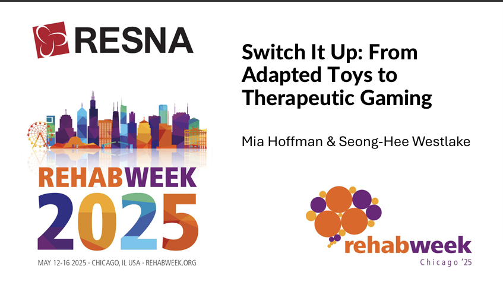

# Resources

## Contents
- [Presentation Slides](#presentation-slides)
- [Files to 3D Print](#3d-printed-resources)
- [Recommended media for disability & technology](#disability--technology-media)

## Presentation-Slides

### RehabWeek 2025 - _Switch It Up: From Switch Adapted Toys to Adaptive Gaming_ 

**Mia Hoffman and Seong-Hee Westlake**

**Talk Summary**
- Identify different types of switches and other controls  
- Modify and position gaming controls for pediatric clients  
- Select games that match a child's interests, cognition, and abilities  
- Use free tools to create simple, customizable games that meet specific therapeutic goals

  <!-- Image Column -->
  

    
  

  <!-- Text Column -->
  

    <h3>RehabWeek 2025 – <em>Switch It Up: From Switch Adapted Toys to Adaptive Gaming</em></h3>
    
<strong>Mia Hoffman and Seong-Hee Westlake</strong>

    <h4>Talk Summary</h4>
    <ul>
      <li>Identify different types of switches and other controls</li>
      <li>Modify and position gaming controls for pediatric clients</li>
      <li>Select games that match a child's interests, cognition, and abilities</li>
      <li>Use free tools to create simple, customizable games that meet specific therapeutic goals</li>
    </ul>
  

---

## 3D Printed Resources

These 3D printed files were created through collaborations between **Mia Hoffman** and **Bethany Sloane** to support pediatric mobility device adaptations. All files are **free to use** and shared **without liability**. Please feel free to download, modify, and integrate them into your own work.

<!-- Markdown table -->

| Mobility device | Description | Creator | Download |
| --------------  | ----------- | ------ | --------- |
| GoBabyGo car |  Large ball to mount on steering wheel | Mia Hoffman | [Download STL](https://github.com/miahoffmannd/miahoffmannd.github.io/blob/main/3dprints/steering-knob-ROC.STL) |
| GoBabyGo car |  Vertical rod to mount on steering wheel | Mia Hoffman | [Download STL](https://github.com/miahoffmannd/miahoffmannd.github.io/blob/main/3dprints/steering-rod-ROC.STL) |
| Permobil Explorer Mini |  Bike handle bar joystick topper | Kate Bokowy | [Download STL](https://github.com/miahoffmannd/miahoffmannd.github.io/blob/main/3dprints/bike-handle-EM.STL) |
| Permobil Explorer Mini | Bowl style joystick topper | Kate Bokowy | [Download STL](https://github.com/miahoffmannd/miahoffmannd.github.io/blob/main/3dprints/donut-climbing-jug-EM.STL) |
| Permobil Explorer Mini | Vertical rod joystick topper | Kate Bokowy | [Download STL](https://github.com/miahoffmannd/miahoffmannd.github.io/blob/main/3dprints/vertical-pole-EM.STL) |
| Radio Flyer Tricycle | Adaptive Pedals | OHSU Team | [Download STL](https://github.com/miahoffmannd/miahoffmannd.github.io/blob/278c2f3498a71435e0374655da7fbd6fee650999/3dprints/RadioFlyer-AssistivePedal.zip) |

---

## Disability & Technology Media
Are you new to the world of assistive technology from a disability studies lens? Here are some of my favorite reads, watches, and listens to get you started on your journey!

<!-- Markdown table -->

| **Citation** | **Link** |
|---------------|-----------|
| 99% Invisble. (July 2021). _The Lows of High Tech_ [Broadcast]. | [Link](https://99percentinvisible.org/episode/the-lows-of-high-tech/) |
| 99% Invisible. (April 2021). _Curb Cuts_ [Broadcast]. | [Link](https://99percentinvisible.org/episode/curb-cuts/) |
| Annie Elainey (Director). (April 2016). _Casual Ableist Language_ [Video recording]. | [Link](https://www.youtube.com/watch?v=a1rrSXkFqGE) |
| Brashear, R. (Director). (2013). _Fixed: The Science/Fiction of Human Enhancement_ [Documentary]. Making Change Media. | [Link](https://fixedthemovie.com/) |
| Cerebral Palsy Foundation (Director). (March 2017). _Zach Anner & The Quest for the Rainbow Bagel_ [Video recording]. | [Link](https://www.youtube.com/watch?v=LhpUJRGrZgc) |
| Doctorow, C. (October 2024). _Disability Rights Are Technology Rights_. Electronic Frontier Foundation. | [Link](https://www.eff.org/deeplinks/2024/06/disability-rights-are-technology-rights) |
| Hendren, Sara (October 2014). _All Technology is Assistive_. Backchannel. | [Link](https://medium.com/backchannel/all-technology-is-assistive-ac9f7183c8cd) |
| Hendren, Sara (2020). _What Can a Body Do?: How We Meet the Built World_. Penguin Random House. | [Link](https://www.penguinrandomhouse.com/books/561049/what-can-a-body-do-by-sara-hendren/) |
| Hurley, A. K. (January 2016). _Gallaudet University’s Brilliant, Surprising Architecture for the Deaf_. _Washingtonian_. | [Link](https://www.washingtonian.com/2016/01/13/gallaudet-universitys-brilliant-surprising-architecture-for-the-deaf/) |
| Jackson, Liz, Haagaard, A., & Williams, R. (April 2022). _Disability Dongle_. _Platypus_. | [Link](https://blog.castac.org/2022/04/disability-dongle/) |
| Kimmelman, M. (July 2020). _Building Accessibility Into America, Literally_. _The New York Times_. | [Link](https://www.nytimes.com/2020/07/20/arts/disabilities-architecture-design.html) |
| Ladau, Emily (2021). _Demystifying Disability: What to Know, What to Say, and How to Be an Ally_. Ten Speed Press. | [Link](https://emilyladau.com/book/) |
| Ladner, Richard E. (2015). _Design for user empowerment_. _Interactions, 22_(2), 24–29. | [Link](https://doi.org/10.1145/2723869) |
| Lebrecht, J. (Director). (March 2025). _Change, not charity: The Americans with Disabilities Act_ [Documentary]. PBWS. | [Link](https://www.pbs.org/wgbh/americanexperience/films/change-not-charity-americans-disabilities-act/) |
| Mullins, Amy (Director). (February 2009). _My 12 pairs of legs_ [Video recording]. TED Conferences. | [Link](https://www.ted.com/talks/aimee_mullins_my_12_pairs_of_legs?language=en&subtitle=en) |
| Newnham, N., & Lebrecht, L. (Directors). (2020). _Crip Camp: A Disability Revolution_ [Documentary]. Netflix. | [Link](https://youtu.be/OFS8SpwioZ4?si=9-O9zZtujtxPnWw3) |
| Wong, Alice. (2020). _Disability Visibility: First-Person Stories from the Twenty-First Century_. Vintage Books. | [Link](https://disabilityvisibilityproject.com/)| 
| Young, Stella (April 2014). _I’m Not Your Inspiration, Thank You Very Much_ [TED Talk]. | [Link](https://www.ted.com/talks/stella_young_i_m_not_your_inspiration_thank_you_very_much) |

